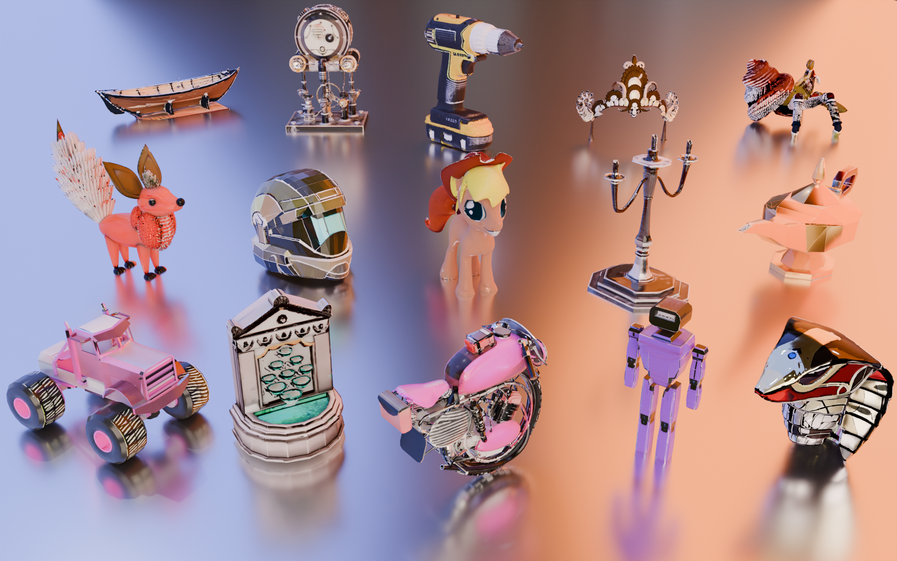

# MCMat - Official PyTorch Implementation

 
 
 
 

 

**MCMat: Multiview-Consistent and Physically Accurate PBR Material Generation**

  

## Code

We are working on releasing the code... 🏗️ 🚧 🔨 Please stay tuned! (Before 03.01 2025, UTC)

- [ ] Inference Model
- [ ] Training Code
